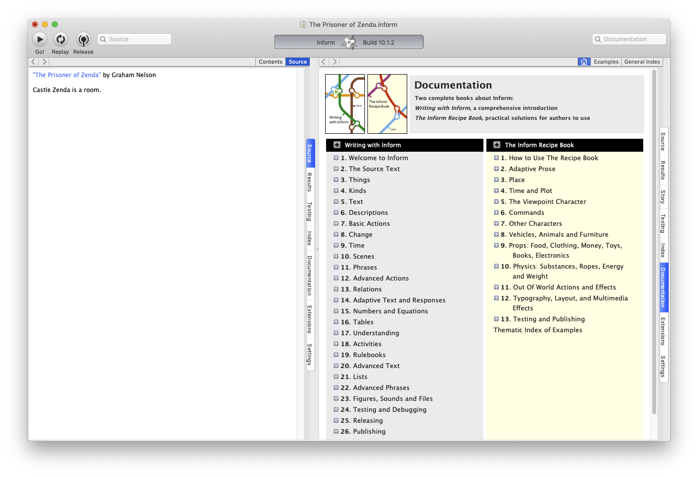
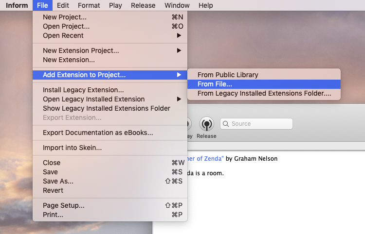
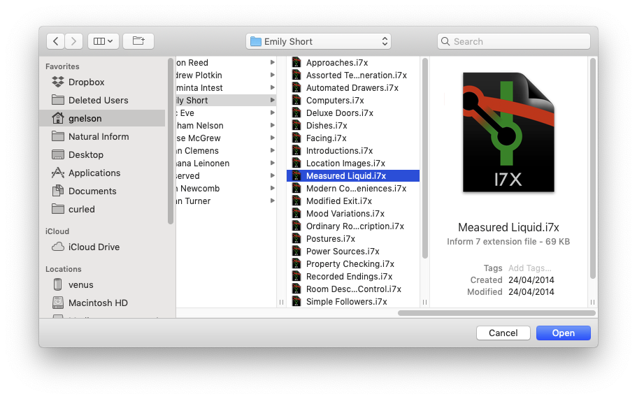
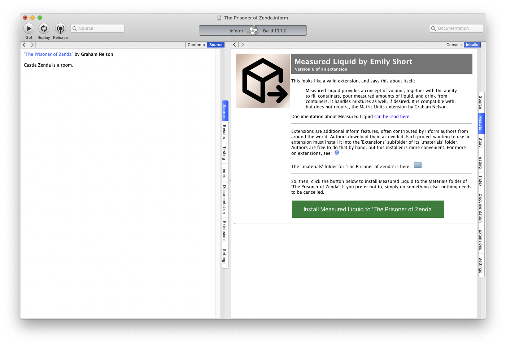
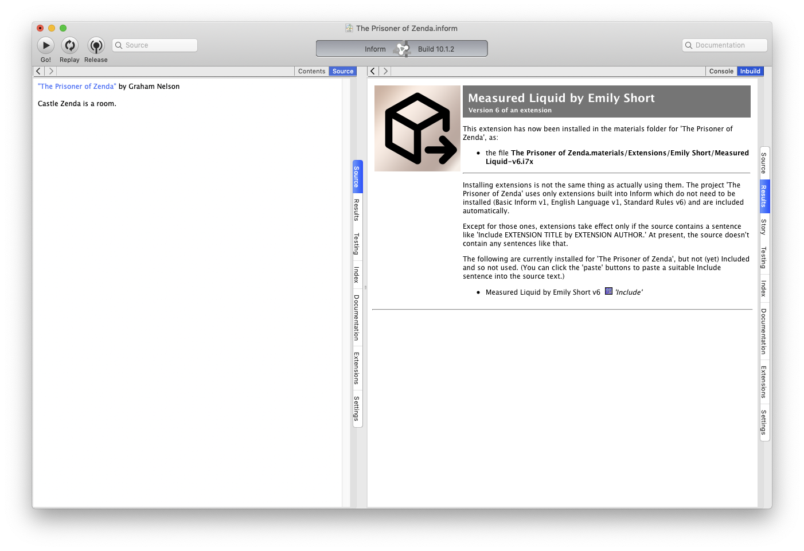
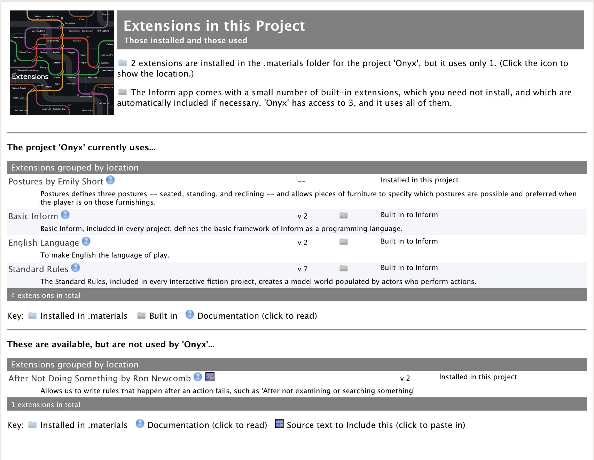

# (IE-0017) Apps and extensions

* Proposal: [IE-0017](0017-apps-and-extensions.md)
* Discussion PR link: [#17](https://github.com/ganelson/inform-evolution/pull/17)
* Authors: Graham Nelson
* Status: Accepted
* Related proposals: [IE-0001](0001-extensions-with-resources.md)
* Implementation: In progress

## Summary

This proposal is a spin-off from work done for [IE-0001](0001-extensions-with-resources.md),
"Directory format for extensions with resources". Under this proposal, the
"user installed extensions area" (or "folder") is abolished, and instead
extensions are installed directly into individual projects. That requires
changes to the three GUI apps in step with corresponding changes to
`inbuild`, the Inform build management tool.

## Motivation

With extensions becoming ever more complicated to deal with, we need to move
logic from the apps to the core tools, and we also want to provide a
fundamentally simpler approach to users. Significant change is inevitable given
[IE-0001](0001-extensions-with-resources.md), because directory-based extensions
can't be installed or downloaded by the apps as they stand. This provides an
opportunity to make a clean break with the previous design and to cut through
a lot of existing complexity.

## Components affected

- [ ] No change to the natural-language syntax.
- [x] Major changes to inbuild.
- [ ] No change to inform7.
- [ ] No change to inter.
- [ ] No change to the Inter specification.
- [ ] No changes to runtime kits.
- [ ] No changes to the Standard Rules and Basic Inform.
- [x] Major changes to documentation.
- [x] Major changes to the GUI apps.

## Impact on existing projects

In one sense, none: anything which could be compiled before can still be compiled
now. But in practice users with existing projects are likely to be including
extensions in them from their "user installed extensions area", so this proposal
if implemented in a severe way would stop those projects from working until the
user had done some tinkering. In practice, we aim to mitigate this nuisance
considerably: see below.

Nothing in this proposal affects the use of Inform at the command line, outside
of the apps.

### Existing approach

Any given Inform project can use extensions which are stored in three different resource locations, or "nests", always in a subdirectory of that nest called `Extensions`:

* The "internal" area, built in to the app. The app never writes to this,
and nor can users. It contains extensions like `Basic Inform` and `English Language`.
* The "external" area, somewhere on the user's computer, which holds a collection of extensions gathered up by that user over the years: a sort of personal collection of useful gadgets. The MacOS app refers to this as "the user installed extensions area", or similar wording. 
* The materials folder belonging to the project itself. The app doesn't write extensions here: but project authors can put extensions here by hand.

#### Installation

All extensions are single files, filenamed `.i7x`. When the app downloads one of these (or otherwise ingests one, e.g. on MacOS by the menu option `File > Install Extension...`), the app has to parse its header to work out the author, title and version. The app then files this in the external area, using the author name and title it has deduced to know where to write it.

After each installation, the app the runs its internal copy of the `inform7` compiler in a so-called "census mode" to force documentation on the extensions to be generated. That documentation lives in a special part of the "external" area. (The user of the app is unaware that this run is being made: it completes quickly enough for most people that there's no apparent delay.)

#### Documentation links

The app contains two hooks to make it possible to browse the HTML documentation which has been written to the external area.

Firstly, the (home page of the) Extensions tab for a project is a webview of the HTML page stored at:

	EXTERNALAREA/Documentation/Extensions/Extensions.html

Secondly, within webviews displayed by the app (the Index, Problem messages, the Extensions index, and so on), the apps intercept URL links like this one:

	inform://Extensions/Extensions/Aaron%20Reed/Poor%20Man%27s%20Mistype.html

and send those to an HTML page in the external area:

	EXTERNALAREA/Documentation/Extensions/Aaron Reed/Poor Man's Mistype.html

(The repetition of `Extensions/` in the URL is not a mistype here. It is the prefix `inform://Extensions/` which is being recognised, and which is redirected to `EXTERNALAREA/Documentation/`.)

### What is wrong with the existing approach

Plenty:
* The apps are not the best place to have to parse and identify extensions. This is the business of the build manager (i.e., `inbuild`), which can keep the relevant code in just one place. It's a bad idea for Windows, Linux and MacOS to be able to go their own ways on, e.g., how to handle certain malformed files.
* Because of [IE-0001](0001-extensions-with-resources.md), which is now largely implemented in the core Inform repository, extensions are about to become much more complicated objects, sometimes occupying whole directories and with sub-resources included. It's important for such extension directories to be carefully checked before use, and the logic involved is not simple. Again, the apps shouldn't have that responsibility.
* Having an external area requires the apps to write to a special location in the user's file system, separate from that of the project at hand. In the age of sandboxing restrictions, this is increasingly vexed. On MacOS, for example, the location is hidden from users and will be in different places on different versions of the OS. If you use both a sandboxed Inform from the Mac App Store, and also a stand-alone unsandboxed download, you can end up with two different external areas in different places.
* It's hard to give an Inform project of any size to somebody else to compile, since they can only do so if they have the same versions of the same extensions in their external area.
* Census mode is inefficient and behaves very awkwardly when malformed extensions are encountered. Its attempts to cross-reference don't work very well, and reindexing every known extension all the time doesn't scale. Removing census mode from `inform7` simplifies its code base, since it's really an anomaly.
* The external area, as an idea, goes back to a time when programmers would only be sporadically online, and needed to be pack rats, keeping their own caches of useful resources: this is how Perl hackers, for example, would work. But it required active curation, if only to keep it updated. Today the Internet is so ubiquitously available that it's no real trouble to freshly download whatever resources are needed for a new project, as build managers for contemporary programming languages (Swift, Rust, etc.) do.
* It's confusing for users to manage multiple versions of things, especially since documentation for versions used by one project can overwrite that for versions used by another. This issue has only become harder for users starting new version 10.* Inform projects but wanting to keep old version 9.* ones working.

### New approach

#### Installation

To "install" an extension now means "to add it to the materials folder for the current (topmost) project". The apps will no longer install extensions to the external area.

##### An easy example

The following screenshots show the general idea, as implemented in the MacOS Inform app.

1. The user begins a new project.

2. One way to install a new extension is by download from the Public Library,
but they can also be installed from menu items, as here:

3. That opens a file-picker dialogue box, and the user selects the file to be
installed. (Here, it's from a big pile of sorted extensions all nicely named,
but it doesn't need to be.)

4. The Inform app responds by opening a page about this extension, which is
automatically identified (and screened for metadata problems, though there
aren't any this time). In effect, it's a confirmation page.

5. The user clicks the big green install button, and...

And now the extension is installed to the project.

##### Sources

The apps must be able to install from the following sources:

* By download from the Public Library page of the Extensions tab in a project window, in response to a click on one of the download or update buttons.
* By an `Add Extension to project...` menu item on the `File` menu, which would lead to a submenu of choices:
	* `From Public Library` - this would simply open the Public Library page of the Extensions tab, in effect inviting users to click one of the buttons there.
	* `From file...` - this would open an operating system file picker dialogue box, allowing one file (or directory - see below) to be selected, but not allowing multiple selections.
	* `From legacy installed extensions folder...` - again, a file picker, but this time opening at what used to the external area in the file system. This is for the sake of users who still have an extensions folder from the old days.

We may eventually want to add two other capabilities, but are not sure:
* A drag of an extension file (or directory) onto the project window, or perhaps just onto its toolbar or one of the tabs other than "Source". (Drags into source generally paste in the contents of text files.)
* `From another project...` - this would open a file picker allowing an Inform project to be selected; a second file picker would then offer a choice of its installed extensions. (We're not sure if this idea really works, or will just seem odd.)

The apps should allow _only_ the following to be selected for installation:

* Single files with the `.i7x` extension.
* Directories whose names end with `.i7xd`.
* Zip archives whose names end with `.zip`, which the app is responsible for unzipping, and which turn out to contain either a single `.i7x` or a single `.i7xd`.

##### What to do once an extension to install has been identified

The apps are _not_ responsible any longer for looking at the contents of these supposed extensions. A file with the extension `.i7x` can be garbage as far the app is concerned: whether it's genuine is a question for `inbuild`.

When the app tries to install such a file/directory, it first copies this to:

	MATERIALS/Extensions/Reserved/Temporary/WHATEVER

where `MATERIALS` is the materials folder for the current project, and `WHATEVER` is the current file/directory name for the extension file/directory. The app may need to create

	MATERIALS/Extensions/Reserved/Temporary/

in order to do this: if so, it should silently do so. The app then calls something like:

	inbuild -project PROJECTDIR -install EXTENSION -results RESULTS

giving the relevant file paths, where `EXTENSION` is the (full path to) the temporary copy it has just made. (The apps will contain a binary copy of `inbuild`, just as they already contain `inform7`, `inform6`, `inblorb` and so on.) `inbuild` will then examine the extension carefully to find out what it is, and if it's an extension at all. `inbuild` will return 0 in all cases, unless there is some sort of improbable file system failure.

What `inbuild` does in response to this call is only to _consider_ installing the extension, and to report on the viability of this. It does so by writing an HTML page to `RESULTS`. The app can put this anywhere it wants to: for example, it might choose to set `RESULTS` to something like -

	PROJECTDIR/Build/Inbuild.html

where it would sit alongside similar throwaway results pages from other binaries inside the app. (But this is up to the app, which could instead choose any temporary location it wants.) Once `inbuild` returns, then, which will always be quickly, the app displays the `Results` tab and shows a webview of `RESULTS` in the `Report` page of `Results`, in the same way that the app would normally display the report on a compilation.

A typical results page might look like this:

	Measured Liquid by Emily Short v6.0.201125
	An extension for use in Inform projects

	This looks like a valid Inform 7 extension, and is not yet part of the current project.

	[Install]

The `[Install]` button would be a friendly green colour. If clicked, this would send a signal back to the app - either by an onclick Javascript call trapped by the app, or by using a link to some special `inform://...` URL (yet to be decided) - to tell the app that the user wants to go ahead.

If `inbuild` finds a damaged or dubious extension, it will say why and not offer an install button; if it finds an extension which the user might not want to install after all - a duplicate of one already there, for example - a warning will be shown and a red button reading `Install Anyway` would be shown.

`inbuild` does one other thing besides producing the results page: it generates documentation on the extension (see below). Indeed, the results page will provide a link to that, so that the user could read the documentation before saying yes to the install.

Note that these results pages are not any kind of modal dialogue box - if the user goes away and does something else, never mind. But if the app does get the signal that the green button has been clicked, it simply repeats the `inbuild` command but adds `-confirmed` to the command-line options:

	inbuild -project PROJECTDIR -install EXTENSION -results RESULTS -confirmed

With `-confirmed` set, `inbuild` goes ahead and actually installs the extension. It produces a second results page, saying what has happened, and the app should thus refresh the `Report` page of the `Results` tab to show this new page.

Assuming all has gone well, `inbuild` has moved and properly named the extension from its temporary location to a final destination such as:

	MATERIALS/Extensions/Emily Short/Locksmith-v2_4_41.i7xd
	MATERIALS/Extensions/Toby Nelson/BBC Micro Emulator.i7x

In any case, whatever `inbuild` has done, it has reported back on the outcome with its `RESULTS` page, and having displayed that, the app's work is done. There is no census mode any longer, so the app no longer has to make a census call to `inform7`.

#### Documentation on extensions

##### New location

All extension documentation will now be stored in the project's materials folder, as HTML. Each different (version of an) extension will have its own directory for this, with the home page being something like:

	MATERIALS/Extensions/Reserved/Documentation/Emily Short/Locksmith-v2_4_41/index.html

All such pages are generated by `inbuild` (see below), and may involve multiple HTML files, and such. We want to allow greater flexibility in future than the current "one HTML file only, no images" arrangement.

Note in particular that HTML-rendered documentation for a directory-stored extension is _not_ inside that directory. In the early versions of proposal `IE-0001` this would have been the case, but commenters felt that this would be insecure, since it could result in users downloading malicious HTML content when installing what seemed to be harmless extensions from the Internet. All rendered documentation (i.e. in HTML form) is now regarded as throwaway.

##### How the app now handles links

Firstly, the (home page of the) Extensions tab for a project is a webview of the HTML page stored at:

	MATERIALS/Extensions/Reserved/Documentation/index.html

_if this file exists_. If it does not, almost certainly because the project has never been compiled and nothing has been installed so that `inbuild` has never generated it, the app falls back on:

	INTERNAL/HTML/NoExtensions.html

a file provided in the core Inform distribution which simply tells the user that the extensions index will be available after the project is compiled.

Secondly, within webviews displayed by the app (the Index, Problem messages, the Extensions index, and so on), the apps intercept URL links like this one:

	inform:/Extensions/Reserved/Documentation/Emily%20Short/Postures/index.html

and send those to an HTML page in the materials area:

	MATERIALS/Extensions/Reserved/Documentation/Emily Short/Postures/index.html

Thus, any URL prefixed `inform:/Extensions/` should be redirected to `MATERIALS/Extensions/` and opened as a file link.

For example, the Extensions home page looks something like this for a project which has installed two extensions but is currently using only one:

As before, it's important for the app to reload these pages rather than cache them, because they are dynamically rewritten when compilations or installations take place.

Again, fall back on the above page if no such file exists.

(In principle, `inbuild` could now choose to generate `file:` links rather than `inform:` ones, but such links would break if the user moved the project around in the file system, so let's keep the `inform:` logic for the moment, but simply move it to the materials area.)

##### New install and uninstall Javascript calls

The Extensions index page now sometimes includes buttons to install an extension (if it is used by a project but currently lives in the legacy area), or to uninstall an extension (if it is installed in a project but not currently used by it). These are displayed using arrow emoji, and are included in the key.

They are hyperlinked to Javascript function calls as follows:

	javascript:project().install("/Users/gnelson/Library/Inform/Extensions/Juhana%20Leinonen/Bulky%20Items.i7x")
	javascript:project().uninstall("/Users/gnelson/work/Inform/Whatever.materials/Extensions/Juhana%20Leinonen/Svelte%20Items.i7xd")

In response to `install(...)`, the app should behave as if the user had selected the menu item to install this extension.

In response to `uninstall(...)`, the app should perform the exact same action, but with the inbuild option being `-uninstall` rather than `-install`, all other command-line switches being the same.

### Legacy issues

As noted above, many users will have projects which want to use extensions they have stored only in their external areas. We need to find a graceful way to help users transition to the new arrangement.

In this new arrangement, we will no longer write to or modify the external area: but we will continue to be able to read from it, as described below.

#### Legacy issues for the apps

The `Settings` tab for a project will contain a new tickbox:

	[x] Allow extensions to be used from the legacy extensions area on your computer, if you have one.

This will be ticked by default for existing projects, and unticked by default for newly created ones.

This tickbox affects the command-line settings supplied to `inform7` when a compilation is made. At present, the app tells the core Inform tools such as `inform7` where to find the external area by supplying `-external DIRNAME` as one of its command-line options. In future:

* If the box is ticked, the app will supply `-deprecated-external DIRNAME` instead of `-external DIRNAME`.
* If the box is not ticked, the app will not supply any form of `-external` at all.

Note that command-line users of Inform, working outside of the apps, can continue
to use `-external` exactly as before: though the apps will no longer use it, the
operation of `-external` has not changed.

#### Legacy issues for inbuild

If the project includes an extension from a nest marked as `-deprecated-external`, the extension will work exactly as normal (though documentation on it will continue to be stored the new way). Nothing which previously compiled will now fail to compile.

However, the Results pages from compilations will contain warnings that the project is using extensions from the deprecated area, and prompting the user to install them into the project instead, at which point the warnings go away.

#### Coping with the loss of census mode

As noted above, the apps used to call `inform7` to perform a census of the legacy extensions area from time to time, to keep the documentation and its indexes up to date. They should now never do so. Attempts to call:

	inform7 -census-update
	inform7 -no-census-update
	inbuild -census
	inbuild -no-census

now result in a message such as:

	(ignoring -census-update and -no-census-update, which have been withdrawn)

but do not yet halt with an error. In some future release, they will be removed altogether.

The MacOS app in fact used census mode for its own purposes, too, parsing the printed output in order to populate some submenus. What it now does is to call

	inbuild/Tangled/inbuild  -inspect -recursive -contents-of AREA -json FILE

where `AREA` is the directory of legacy extensions (or whatever else it wants to look at), and `FILE` is a filename for a JSON file to write. If this is a hyphen, `-`, then the JSON is output to `stdout` instead, and can thus be piped to other Unix tools.

The JSON file contains search results for what `inbuild` found inside `AREA`. Formally, this complies with the requirements in

	inform7/Internal/Miscellany/inbuild.jsonr

Briefly, though, it looks something like this:

	{
		"inspection": [ {
			"resource": {
				"type": "extension",
				"title": "Commonly Unimplemented",
				"author": "Aaron Reed",
				"version": "2"
			},
			"location-file": "/Users/gnelson/Library/Inform/Extensions/Aaron Reed/Commonly Unimplemented.i7x"
		}, {
			"resource": {
				"type": "extension",
				"title": "Locksmith",
				"author": "Emily Short",
				"version": "14"
			},
			"location-file": "/Users/gnelson/Library/Inform/Extensions/Emily Short/Locksmith.i7x"
		} ]
	}

That is, the file contains a single object. Inspection results are in the member `inspection`, which is an array (i.e., a JSON list) of result objects. Each result always has `resource`, identifying what has been found, and exactly one of `location-file` or `location-directory`.

If `inbuild` found errors in scanning the object, a list of these as strings appears as the field `errors`:

		{
			"resource": {
				"type": "extension",
				"title": "When To The Sessions Of Sweet Silent Thought I Conjure Up",
				"author": "Araminta Intest"
			},
			"errors": [ "title too long: 57 characters (max is 51)" ],
			"location-file": "/Users/gnelson/Library/Inform/Extensions/Araminta Intest/When To The Sessions Of Sweet Silent Thought I Conjure Up.i7x"
		}

The `resource` contains up to four fields: `type` and `title` are mandatory, `author` is mandatory for extensions but not for some other genres of resource, and `version` exists if and only if the resource has a version number. (Extensions should, but do not always.) The `type` is at present one of these:

	kit
	extension
	language
	project
	pipeline
	template

Note that the way to tell an extension stored in directory form from one stored in traditional file form is to see whether it has a `location-file` or a `location-directory`.

### Public Library downloading features

The apps currently have to contain special logic for downloading collections of extensions at a time from the Public Library: that can all go. From now on, only one extension will be downloaded at a time.

At present, Public Library download links look like so:

	library:/resources/Extensions/Bart%20Massey/Basic%20Literacy.i7x?id=59

These links will not change except that the file can now be a zip, so e.g.:

	library:/resources/Extensions/Bart%20Massey/Basic%20Literacy.zip?id=59

This zip may unzip either to a `.i7x` file or a `.i7xd` directory, and it is the app's responsibility to perform the unzipping (see above). In particular, even for a directory extension, the link cannot be to an unzipped directory: the app can assume that just a single binary blob is downloaded at a time.
