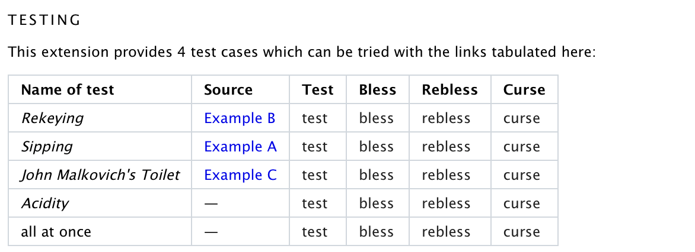
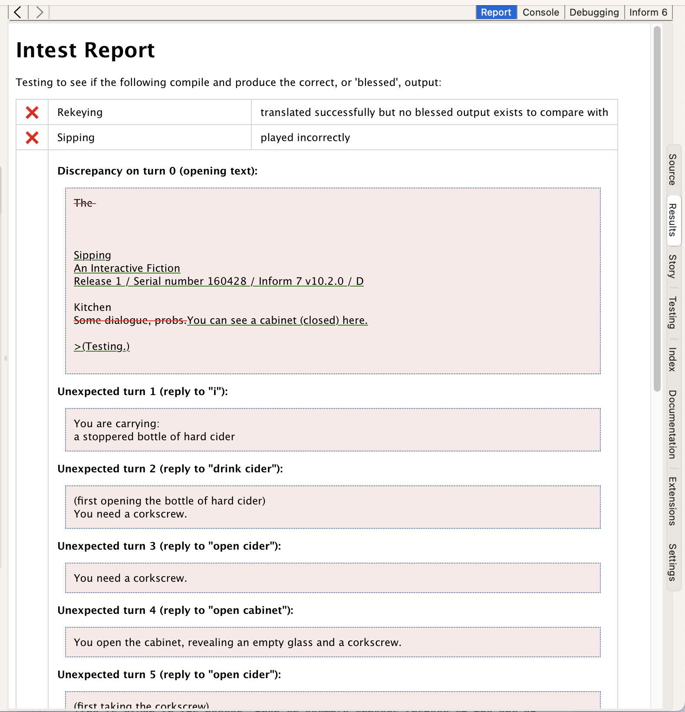

# (IE-0030) Extension examples and testing

* Proposal: [IE-0030](0030-extension-examples-and-testing.md)
* Discussion PR link: [#30](https://github.com/ganelson/inform-evolution/pull/30)
* Authors: Graham Nelson
* Status: Accepted
* Related proposals: [IE-0028](0028-extension-documentation-revisited.md), [IE-0001](0001-extensions-with-resources.md)
* Implementation: None as yet

## Summary

The new directory format for extensions (see [IE-0001](0001-extensions-with-resources.md))
allows a better way to store examples and test cases, and new features in the Inform
testing tool intest make it easier to test extensions using these.

## Motivation

At present, it's difficult to test extensions, especially old ones, for
compatibility with different versions of Inform. In practice, often the best
that can be done is to see if simple projects including them still compile.
It's clearly better for extension authors to be able to provide a small suite
of test cases, and [IE-0001](0001-extensions-with-resources.md) makes that
feasible for the first time. In particular, we would like the examples
supplied with extensions to be easily tested.

## Components affected

- [ ] No change to the natural-language syntax.
- [x] Minor changes to inbuild.
- [ ] No changes to inform7.
- [ ] No change to inter.
- [ ] No change to the Inter specification.
- [ ] No changes to runtime kits.
- [ ] No changes to the Standard Rules and Basic Inform.
- [ ] No change to documentation.
- [ ] No change to the GUI apps.

## Impact on existing projects

None.

## Storing examples in stand-alone files

None of the features below are useable with single-file extensions,
the traditional format used for them, so to adapt an existing extension to
use stand-alone example files, one must first convert it to directory format.
This can be done with the `-modernise` feature of `inbuild`, and in fact
that feature automatically converts the examples to the format below, so
that extension authors shouldn't need to do much work to get started.

Under [IE-0001](0001-extensions-with-resources.md), extensions are stored
as directories. Documentation is in the subdirectory of the same name;
examples are in a further subdirectory. For example:

	Locksmith-v15.i7xd
		...
		Documentation
			Documentation.md
				Examples
					Watchtower.md
					Tobacco.md
					Rekeying.md
					Latches.md

The file `Documentation.md` is plain text marked up in Markdown format: see
[IE-0028](0028-extension-documentation-revisited.md). The example files use
the same format, except that they begin with headers describing them. The
header consists of lines which must all be in the form

	Key: Value

The header ends with a blank line, and then the body of the example begins.
This is a typical opening for an example:

	Example: *** Watchtower
	Description: Using sequential actions to make the player's activities more equal with those of another character.
	
	Suppose that instead of the...

The opening line must always have the format `Example: ** Title`, where `**`
is some number of asterisks between 1 and 4. A subsequent line must also give
the `Description:`, though it doesn't actually have to be next. All other
potential keys are optional.

## Storing test cases in stand-alone files

Optionally, an extension can also contain one or more "test cases". These
exist only for testing, not documentation, so although they are similar to
examples, they are much simpler in structure. They occupy `Documentation/Tests`
rather than `Documentation/Examples`, and their opening like takes the form
`Test: Title`. Once the header is finished, there is a skipped line and
then an Inform source text - this is not indented and not surrounded by
documentation.

Here is a sample test case:

	Test: Abacus-G
	For: Glulx

	The Counting House is a room.

	An abacus is here. A man called the King is here. The King wears a crown.

	Test me with "showme / examine me / examine abacus / examine King / examine crown".

Just as Inform documentation examples use the same file format as extension
examples, Inform's test suite uses test cases to verify that the compiler is
working which have the same file format as extension tests.

## Testing an extension at the command line

One way to use the new testing facilities is with the command-line tool `intest`.
A full manual for this can be seen [here](https://ganelson.github.io/intest/intest/index.html),
but this is a lot to take in and it would need to be read alongside the
testing script used for Inform testing ([which is here, but not simple to follow](https://github.com/ganelson/inform/blob/master/inform7/Internal/Delia/Main.delia)).
So the following guide is meant to give a quick guide to testing an extension
from the command line. (See below for testing in the apps.)

To run a testing command from the command line, type something like:

	$ ../intest/Tangled/intest EXTENSION COMMAND

For example,

	$ ../intest/Tangled/intest dev/Extensions/Emily\ Short/Locksmith-v15.i7xd -list all

runs the Intest command `-list all` on the range of examples and test cases found
in the extension Locksmith by Emily Short.

Here we're assuming that the current working directory is `inform`, the home
directory of the core Inform repository (i.e., [this](https://github.com/ganelson/inform)),
and that alongside that is an installation of `intest`. But in fact the current
working directory can be anything provided that you specify where to find
Inform's "internal resources":

	$ intest -internal PATH-TO-INTERNAL EXTENSION COMMAND

So for example, something like:

	$ intest -internal dev/core/inform/inform7/Internal dev/Extensions/Emily\ Short/Locksmith-v15.i7xd -test all

### Specifying which examples or cases to test

Intest commands apply an action to one or more examples or tests. The default
action is `-test`, so if no action is given, this is what will be done.
Items to test can be specified by name, or `all` can be used to mean all of them,
or `examples` for just the examples, or `cases` for just the tests which are
not examples. When testing Locksmith by Emily Short, therefore, the simple
command `all` is equivalent to `-test Watchtower Tobacco Rekeying Latches`,
though in fact it runs more quickly because it runs the four tests simultaneously
on four different cores of your computer, rather than running them one at a time.

### The -test, -show, -bless, -curse and -rebless actions

Extracts the source text from an example (or test case) file, then
compiles it, then runs the result. A series of inputs is typed into that story,
and its printed output is recorded. If this output matches a "blessed" version,
known to be ideal, the test passes. If anything goes wrong along the way, or
the output is wrong, the test fails.

If an example is newly written, you won't have any ideal output to compare against.
Running it produces a cautionary message:

	$ ../intest/Tangled/intest dev/Extensions/Emily\ Short/Locksmith-v15.i7xd Watchtower
	[1] Watchtower translated successfully but no ideal transcript existed

If an example is filenamed `Watchtower.txt`, its blessed output should be
stored as a text file called `Watchtower--I.txt`. (That double-dash `--` is
a convention used to show that this file is a sidekick of `Watchtower.txt`,
and is not another example.) `I` stands for "ideal". This is the file you
currently haven't got. Do not make it by hand. Instead, see what the current
output looks like with the `-show` action:

	$ ../intest/Tangled/intest dev/Extensions/Emily\ Short/Locksmith-v15.i7xd -show Watchtower

	Watchtower
	An Interactive Fiction
	Release 1 / Serial number 160428 / Inform 7 v10.2.0 / D

	Bridge
	Beneath this long, narrow bridge is a gully full of ice-water from the mountains above. It runs milky at this time of year, and is not fit to drink. The air off it is bitterly cold. Just north of here is the Roman watchtower, built square and still defensible despite several centuries of neglect.

	You can see Leif here.

	>(Testing.)

	>[1] drop key
	Dropped.

	>[2] open door
	You lack a key that fits the tower door.

	>[3] get key
	Taken.

(and so on: there's more like that). Read this through and see if you're happy
that the extension is doing as it should. Once it is, use `-bless`:

	$ ../intest/Tangled/intest dev/Extensions/Emily\ Short/Locksmith-v15.i7xd -bless Watchtower

This saves out the current output as the new ideal version, i.e., it takes that
output and puts it into the file `Watchtower--I.txt`. All future tests will
compare against this version.

As time goes by, you may want to withdraw this ideal version (use `-curse` to
get rid of it) or, more likely, change it (use `-rebless` to say that the
current output is in fact correct and should replace the version previously
thought to be ideal).

In the test being run above, the story had `drop key`, then `open door`, then
`get key` typed into it. This happened because Intest could see the following
line as part of the source text for Watchtower:

	Test me with "drop key / open door / get key / n / s / lock door / drop key / Leif, get key / Leif, n".

This is a longstanding Inform convention, so please use it whenever possible.
But for a few tests, notably those which involve restarting the story file or
performing UNDO commands, the "script" of commands needs to be stored in another
sidekick file to the example. If so, create such a file with one input on
each line, and filename it `Watchtower--S.txt`: `S` is for "script".

### The -show actions

There are actually several different `-show...` actions, for those who need to
dig into exactly what is happening.

`-show` is an abbreviation for `-show-transcript`.

`-show-transcript` prints out the output from the compiled story file.

`-show-ideal` prints out the blessed output, if it exists.

`-show-source` prints out the Inform source text being used for the test, that
is, it shows what source text has been extracted from the example or test file.

`-show-i7` prints out what the `inform7` compiler printed to the console when
it compiled the source text.

`-show-log` prints out the debugging log recorded by the `inform7` compiler
as it ran. You can also affect what goes into the debugging log by putting
the name of a "debugging log aspect" into the global intest variable `$$LOG`.
For example, `-set 'LOG=implications' -show-log AccessAllAreas` runs the
test `AccessAllAreas` and prints out the debugging log with implications
tracing included. For a list of valid values of `$$LOG`, see the foot of the
debugging log, which always shows the possible aspects used and not used.
Be warned that this can sometimes produce a lot of output: `-set 'LOG=predicate-calculus'`,
for example, is not for the faint-hearted.

`-show-i6` prints out what the `inform6` compiler subsequently printed to the
console when it constructed the final story file. This only works if the test
makes a Z-machine or Glulx story file.

`-show-inter` prints out the textual form of the intermediate ("inter")
representation of the program. This produces a lot of output, so only use this
option when indirecting the output somewhere.

`-show-inform6` prints out the Inform 6 source code output by the `inform7`
compiler. This only works if the test compiles via `inform6`, and it produces a
lot of output, so only use this option when indirecting the output somewhere.

`-show-c` prints out the C source code output by the `inform7` compiler. This
only works if the test compiles via C, and it produces a lot of output, so
only use this option when indirecting the output somewhere.

`-show-cc` prints out what the C compiler subsequently printed to the
console when it constructed the final executable. This only works if the test
compiles via C.

`-show-link` similarly prints out what the C linker printed to the console.

`-show-blurb` is only relevant for test cases with `TestReleaseMetadata: Yes` set,
see below, and prints out the Blurb file output by `inform7`.

`-show-ifiction` is only relevant for test cases with `TestReleaseMetadata: Yes` set,
see below, and prints out the iFiction file output by `inform7`.

Testing an Inform project involves quite a lot of hidden work. If the above isn't
revelatory enough, add `-verbose` before the testing command, but be prepared for
a lot of output.

## Testing an extension inside the GUI apps

The front page of an extension's documentation contains a set of links, in
table form, which are buttons for running some of the above testing actions.
This will look nicer later, but something like:

These buttons carry out the actions `-test X`, `-bless X` and so on, where
`X` is either `all` or a test case name. For example, clicking *test* in the *all at once*
row might produce:

How is this done? The answer is that the extension documentation contains
links which make Javascript function calls, similar to those used to install
or uninstall extensions, and following the same basic conventions. The app
must trap such function calls and act on them.

In particular, the app needs to respond to this function:

	javascript:project().test("PATH", "COMMAND", "CASE")

For example:

	javascript:project().test("/Users/gnelson/dev/Testy.materials/Extensions/Graham Nelson/Whatever-v3.i7xd", "-test", "MansfieldPark")

This tells the app to call intest like so:

	intest PATH -internal INTERNAL -results FILE -set 'I7COMPILER = ...' -set 'I6COMPILER = ...' -set 'GINTERPRETER = ...' -set 'ZINTERPRETER = ...' -workspace WORKSPACE COMMAND CASE

There's a lot to unpack here, so working through this command from left to right:

- `intest` is one of the executables inside the app, like `inform7` and so on,
but if we have the advanced setting ticked to `Use external Inform Core
directory`, then we have to assume that `intest` is an external directory
alongside `inform` (i.e. that these two repositories were cloned alongside each
other with the same parent directory) and then use `intest/Tangled/intest`.

- `PATH` is encoded exactly as it was for the `install()` command. Whatever the
app did to translate that into a directory name, it can do the same here. It
will indeed be a directory name, since it will be the location of a
directory-format extension.

- `-internal INTERNAL` should be handled exactly as it is when calling `inbuild`
or `inform7` from the app. Note again that the location given depends on whether
`Use external Inform Core directory` is ticked, just as it does when calling
those other tools.

- `-results FILE` is intended to be just like using the same option used if the
app is asking `inbuild` to install or uninstall something. It's a location for a
scratch HTML file to be written to, and can be anywhere the app thinks sensible.

- The four settings give the locations of four executables: `inform7`,
`inform6`, `glulxe` and `dumb-frotz`. The app should normally point to its own
internal copies. (Up to now, the app hasn't contained (the testing version of)
`glulxe` or `dumb-frotz`: it will now have to.) If the `Use external Inform Core
directory` option is ticked, then give these as:

      inform/inform7/Tangled/inform7
      inform/inform6/Tangled/inform6
      inform/inform6/Tests/Assistants/dumb-glulx/glulxe/glulxe
      inform/inform6/Tests/Assistants/dumb-frotz/dumb-frotz

- `-workspace WORKSPACE` should give a directory which `intest` can use as a
playground, creating and destroying as many files or directories as it likes
inside. When the command begins, `WORKSPACE` must exist, but it doesn't matter
what it contains. When the command finished, assume nothing about what is then
still in `WORKSPACE`.

- The `COMMAND` will be a simple dashed switch, like `-test`. You needn't worry
about escaping any characters here.

- The `CASE` will be an `intest` wildcard like `all` or else a case name, and
those are also character-safe, in that they have no spaces and no punctuation
except for internal hyphens.

`intest` will take some time to run, and will produce (a little) output to
`stdout` and/or `stderr`, so it should ideally run in the `Console` pane of the
app, like `inform7` or `inform6`. By default, if running multiple tests, it will
run this concurrently on multiple processor cores, but if that's a problem for
the app then it can use `intest` command-line switches to turn that off.

When it completes the tests, the app should display the `FILE` page in the
`Results` pane of the app.

## Optional header lines

As noted above, every example file should open `Example: ** Title`, and every
test case file should open `Test: Title`. After that, any number of optional
header lines can appear (including none), and they can be in any order. The
current range of possibilities is:

(1) `Location: Heading`.
Since our examples have been detached from the main `Documentation.txt` file,
it is now unclear where they should appear. By default (as for "Watchtower"
above), they are placed at the end of the documentation. But if a `Location:`
line is given in its header, then an example appears instead at the end of
the section whose name is given. For example, `Location: Picklocks` would
cause the example to be placed at the end of either a chapter or a section
whose title was "Picklocks". If a location is given which is not the title
of any chapter or section, an error is issued.

(2) `RecipeLocation: Heading`.
This is ignored for examples in extensions, but is used by examples in the
main Inform documentation, and indicate which section of "The Recipe Book"
they should be filed in. (Inform examples use an identical file format to
extension examples, but are present in two books at once, so they need two
different location indicators.)

(3) `Index: Text`.
Again, this is used for Inform documentation examples but ignored for extension
examples. It gives a brief descriptive text to appear in the A-Z index of
documentation examples.

(4) `Description: Text`.
This is the strap-line underneath an example title, usually giving a brief
explanation of what is being demonstrated. While it is not strictly compulsory,
an example should really provide this. It's ignored for test cases.

(5) `Language: Basic` or `Language: Inform`.
The default here is `Language: Inform`, which means the example/test should be run
using the normal Inform programming language. `Language: Basic` says that it
is a Basic Inform example, that is, uses the pared-down version of the language
with all interactive fiction features removed.

(6) `CompatibleWith: Description`.
This can be used to mark an example as being compatible only with certain
platforms. Most examples work on any platform, so the default `CompatibleWith: all`
is fine.

(7) `For: Z-Machine` or `For: Glulx` or `For: C` or `For: Untestable`.
Which platform the code should be compiled to when this example/test is
tested. The default is `For: Glulx` provided that Glulx is compatible with
the `CompatibleWith` description, and `For: Z-Machine` if it is not.
If an even finer distinction is needed, `For:` can be set equal to any
format text which Inform recognises: in fact, `For: Glulx` is a synonym
for `For: inform6/32`.

`For: Untestable` says that an example doesn't really contain code which
can usefully be tested, and that Intest can therefore ignore this example;
test cases are not allowed to say this, since a test case which cannot be
tested is a contradiction in terms.

(8) `CompileOnly: Yes` or `CompileOnly: No` (the default is `No`).
This can specify that a test should be compiled through the `inform7` compiler
but then taken no further. The test is considered a success if no error messages
are issued, and if the right console output is produced by the compiler.
Extension tests just might need to set this if an example is too complex to
test fully, for example if it involves complicated screen effects.

(9) `TestCompilerInternals: Yes` or `TestCompilerInternals: No` (the default is `No`).
This is only used for unit tests internal to the `inform7` compiler. Switching
this on makes it possible to use the otherwise forbidden `Test ... (internal) with ...`
in source text, which makes the compiler reveal its innermost thoughts.
Extension tests will not need this.

(10) `TestReleaseMetadata: Yes` or `TestReleaseMetadata: No` (the default is `No`).
This is only used for testing the Inform compiler, and specifically verifying
the blurb and iFiction files it outputs on a release run. Extension tests will
not need this.

(11) `GenerateIndex: Yes` or `GenerateIndex: No` (the default is `No`).
Tests of an example or a test case are carried out in a throwaway Inform project,
so that there is usually no point rebuilding the Index at the end of compilation --
nobody will ever see it. But if the point of the test is exactly to check that
the Index has been written correctly, then of course we do need to generate it,
and it's for those test cases that this option exists.
Extension tests will not need this.

(12) `GenerateDiagnostics: Yes` or `GenerateDiagnostics: No` (the default is `No`).
Used only by one Inform compiler test case, and only to output certain files
which show diagrams of internal data structures for use in the technical
documentation on the website. Extension tests will not need this.

## A note on testing kits

Some extensions contain kits of Inter code (see [IE-0001](0001-extensions-with-resources.md)).
These can also have documentation, examples and test cases, in exactly the format
described above, and can be tested with all of the same commands.
